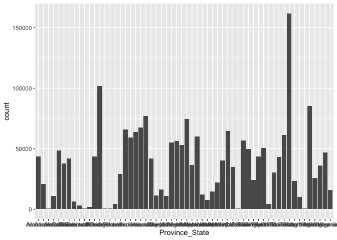
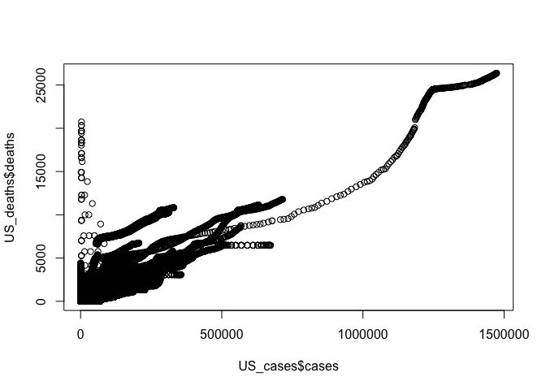
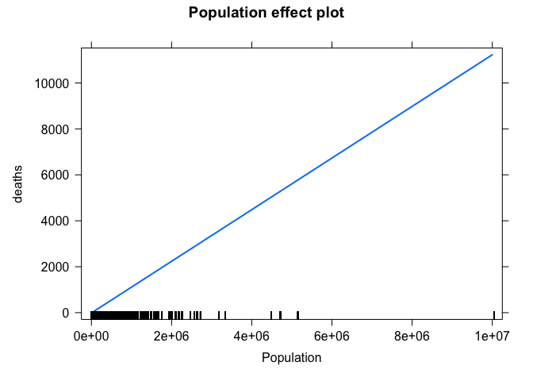

JohnHopkins
================
N.L
10/14/2021

``` r
#Follow the steps of the Prof. to insert the data frame into RMD
library(tidyverse)
```

    ## ── Attaching packages ─────────────────────────────────────── tidyverse 1.3.1 ──

    ## ✓ ggplot2 3.3.5     ✓ purrr   0.3.4
    ## ✓ tibble  3.1.4     ✓ dplyr   1.0.7
    ## ✓ tidyr   1.1.3     ✓ stringr 1.4.0
    ## ✓ readr   2.0.1     ✓ forcats 0.5.1

    ## ── Conflicts ────────────────────────────────────────── tidyverse_conflicts() ──
    ## x dplyr::filter() masks stats::filter()
    ## x dplyr::lag()    masks stats::lag()

``` r
url_in <- "http://raw.githubusercontent.com/CSSEGISandData/COVID-19/master/csse_covid_19_data/csse_covid_19_time_series/"
file_names <-c("time_series_covid19_confirmed_global.csv",
               "time_series_covid19_deaths_global.csv",
               "time_series_covid19_confirmed_US.csv",
               "time_series_covid19_deaths_US.csv")
library(stringr)
urls <- str_c(url_in,file_names) 
```

``` r
global_cases <- read_csv(urls[1])
```

    ## Rows: 279 Columns: 636

    ## ── Column specification ────────────────────────────────────────────────────────
    ## Delimiter: ","
    ## chr   (2): Province/State, Country/Region
    ## dbl (634): Lat, Long, 1/22/20, 1/23/20, 1/24/20, 1/25/20, 1/26/20, 1/27/20, ...

    ## 
    ## ℹ Use `spec()` to retrieve the full column specification for this data.
    ## ℹ Specify the column types or set `show_col_types = FALSE` to quiet this message.

``` r
global_deaths <- read_csv(urls[2])
```

    ## Rows: 279 Columns: 636

    ## ── Column specification ────────────────────────────────────────────────────────
    ## Delimiter: ","
    ## chr   (2): Province/State, Country/Region
    ## dbl (634): Lat, Long, 1/22/20, 1/23/20, 1/24/20, 1/25/20, 1/26/20, 1/27/20, ...

    ## 
    ## ℹ Use `spec()` to retrieve the full column specification for this data.
    ## ℹ Specify the column types or set `show_col_types = FALSE` to quiet this message.

``` r
US_cases <- read_csv(urls[3])
```

    ## Rows: 3342 Columns: 643

    ## ── Column specification ────────────────────────────────────────────────────────
    ## Delimiter: ","
    ## chr   (6): iso2, iso3, Admin2, Province_State, Country_Region, Combined_Key
    ## dbl (637): UID, code3, FIPS, Lat, Long_, 1/22/20, 1/23/20, 1/24/20, 1/25/20,...

    ## 
    ## ℹ Use `spec()` to retrieve the full column specification for this data.
    ## ℹ Specify the column types or set `show_col_types = FALSE` to quiet this message.

``` r
US_deaths<- read.csv(urls[4])

global_cases <-global_cases %>%
pivot_longer(cols = -c(`Province/State`,                  `Country/Region`, Lat,Long),
names_to = "date",
values_to = "cases") %>%
select(-c(Lat,Long))
global_cases
```

    ## # A tibble: 176,328 × 4
    ##    `Province/State` `Country/Region` date    cases
    ##    <chr>            <chr>            <chr>   <dbl>
    ##  1 <NA>             Afghanistan      1/22/20     0
    ##  2 <NA>             Afghanistan      1/23/20     0
    ##  3 <NA>             Afghanistan      1/24/20     0
    ##  4 <NA>             Afghanistan      1/25/20     0
    ##  5 <NA>             Afghanistan      1/26/20     0
    ##  6 <NA>             Afghanistan      1/27/20     0
    ##  7 <NA>             Afghanistan      1/28/20     0
    ##  8 <NA>             Afghanistan      1/29/20     0
    ##  9 <NA>             Afghanistan      1/30/20     0
    ## 10 <NA>             Afghanistan      1/31/20     0
    ## # … with 176,318 more rows

``` r
global_deaths <-global_deaths %>%
pivot_longer(cols = -c(`Province/State`,                  `Country/Region`, Lat,Long),
names_to = "date",
values_to = "deaths") %>%
select(-c(Lat,Long))
global_deaths
```

    ## # A tibble: 176,328 × 4
    ##    `Province/State` `Country/Region` date    deaths
    ##    <chr>            <chr>            <chr>    <dbl>
    ##  1 <NA>             Afghanistan      1/22/20      0
    ##  2 <NA>             Afghanistan      1/23/20      0
    ##  3 <NA>             Afghanistan      1/24/20      0
    ##  4 <NA>             Afghanistan      1/25/20      0
    ##  5 <NA>             Afghanistan      1/26/20      0
    ##  6 <NA>             Afghanistan      1/27/20      0
    ##  7 <NA>             Afghanistan      1/28/20      0
    ##  8 <NA>             Afghanistan      1/29/20      0
    ##  9 <NA>             Afghanistan      1/30/20      0
    ## 10 <NA>             Afghanistan      1/31/20      0
    ## # … with 176,318 more rows

``` r
library(lubridate)
```

    ## 
    ## Attaching package: 'lubridate'

    ## The following objects are masked from 'package:base':
    ## 
    ##     date, intersect, setdiff, union

``` r
global <-global_cases %>%
  full_join(global_deaths) %>%
  rename(Country_Region = `Country/Region`,
         Province_State = `Province/State`) %>%
  mutate(date = mdy(date))
```

    ## Joining, by = c("Province/State", "Country/Region", "date")

``` r
global
```

    ## # A tibble: 176,328 × 5
    ##    Province_State Country_Region date       cases deaths
    ##    <chr>          <chr>          <date>     <dbl>  <dbl>
    ##  1 <NA>           Afghanistan    2020-01-22     0      0
    ##  2 <NA>           Afghanistan    2020-01-23     0      0
    ##  3 <NA>           Afghanistan    2020-01-24     0      0
    ##  4 <NA>           Afghanistan    2020-01-25     0      0
    ##  5 <NA>           Afghanistan    2020-01-26     0      0
    ##  6 <NA>           Afghanistan    2020-01-27     0      0
    ##  7 <NA>           Afghanistan    2020-01-28     0      0
    ##  8 <NA>           Afghanistan    2020-01-29     0      0
    ##  9 <NA>           Afghanistan    2020-01-30     0      0
    ## 10 <NA>           Afghanistan    2020-01-31     0      0
    ## # … with 176,318 more rows

``` r
summary(global)
```

    ##  Province_State     Country_Region          date                cases         
    ##  Length:176328      Length:176328      Min.   :2020-01-22   Min.   :       0  
    ##  Class :character   Class :character   1st Qu.:2020-06-27   1st Qu.:     154  
    ##  Mode  :character   Mode  :character   Median :2020-12-02   Median :    2543  
    ##                                        Mean   :2020-12-02   Mean   :  308273  
    ##                                        3rd Qu.:2021-05-09   3rd Qu.:   58120  
    ##                                        Max.   :2021-10-14   Max.   :44767906  
    ##      deaths      
    ##  Min.   :     0  
    ##  1st Qu.:     1  
    ##  Median :    40  
    ##  Mean   :  7023  
    ##  3rd Qu.:   960  
    ##  Max.   :721563

``` r
global <- global %>% filter(cases > 0)

global %>% filter(cases > 44000000)
```

    ## # A tibble: 9 × 5
    ##   Province_State Country_Region date          cases deaths
    ##   <chr>          <chr>          <date>        <dbl>  <dbl>
    ## 1 <NA>           US             2021-10-06 44058827 708110
    ## 2 <NA>           US             2021-10-07 44158910 710502
    ## 3 <NA>           US             2021-10-08 44290052 712339
    ## 4 <NA>           US             2021-10-09 44317989 712618
    ## 5 <NA>           US             2021-10-10 44340183 712873
    ## 6 <NA>           US             2021-10-11 44456385 714055
    ## 7 <NA>           US             2021-10-12 44562693 716471
    ## 8 <NA>           US             2021-10-13 44684150 719558
    ## 9 <NA>           US             2021-10-14 44767906 721563

``` r
US_cases <- US_cases %>%
   pivot_longer(cols = -(UID:Combined_Key),
                names_to = "date",
                values_to = "cases") %>%
   select(Admin2:cases) %>%
   mutate(date = mdy(date)) %>%
   select(-c(Lat,Long_))

US_deaths <- US_deaths %>%
   pivot_longer(cols = -(UID:Population),
                names_to = "date",
                values_to = "deaths") %>%
   select(Admin2:deaths) %>%
   mutate(date = mdy(date)) %>%
   select(-c(Lat,Long_))
```

    ## Warning: All formats failed to parse. No formats found.

``` r
global <- global %>%
   unite("Combined_Key",
         c(Province_State, Country_Region),
         sep = ",",
         na.rm = TRUE,
         remove = FALSE)


global
```

    ## # A tibble: 160,265 × 6
    ##    Combined_Key Province_State Country_Region date       cases deaths
    ##    <chr>        <chr>          <chr>          <date>     <dbl>  <dbl>
    ##  1 Afghanistan  <NA>           Afghanistan    2020-02-24     5      0
    ##  2 Afghanistan  <NA>           Afghanistan    2020-02-25     5      0
    ##  3 Afghanistan  <NA>           Afghanistan    2020-02-26     5      0
    ##  4 Afghanistan  <NA>           Afghanistan    2020-02-27     5      0
    ##  5 Afghanistan  <NA>           Afghanistan    2020-02-28     5      0
    ##  6 Afghanistan  <NA>           Afghanistan    2020-02-29     5      0
    ##  7 Afghanistan  <NA>           Afghanistan    2020-03-01     5      0
    ##  8 Afghanistan  <NA>           Afghanistan    2020-03-02     5      0
    ##  9 Afghanistan  <NA>           Afghanistan    2020-03-03     5      0
    ## 10 Afghanistan  <NA>           Afghanistan    2020-03-04     5      0
    ## # … with 160,255 more rows

``` r
ggplot(US_cases, 
      aes(x = Province_State, 
           fill = cases)) + 
   geom_bar(position = "stack")
```

<!-- -->

``` r
#What the plot above shows is that roughly speaking, 
#all areas of the US are seeing some amounts of Covid. 
#The graph shows almost a wave formation between where 
#Covid has hit the most and where its almost nonexistent.


plot(US_cases$cases,US_deaths$deaths)
```

<!-- -->

``` r
#What is interesting about the plot above is that it shows 
#the audience that in the beginning of the pandemic, 
#there was no correlation between the amount of cases and deaths. 
#However, as time went on and the number of cases rose, 
#so did the deaths in a linear fashion 

cor.test(US_cases$cases,US_deaths$deaths)
```

    ## 
    ##  Pearson's product-moment correlation
    ## 
    ## data:  US_cases$cases and US_deaths$deaths
    ## t = 3133, df = 2112142, p-value < 2.2e-16
    ## alternative hypothesis: true correlation is not equal to 0
    ## 95 percent confidence interval:
    ##  0.9069143 0.9073919
    ## sample estimates:
    ##       cor 
    ## 0.9071534

``` r
#I officially tested to see how much of  a correlation is 
#there between US cases and US deaths. I found there to be a correlation
#of 0.9073, or rounded up, a 91% correlation between 
#the number of cases and the number of deaths. 

#install.packages (" effects", repos =" http://cran.us.r-project.org ") 
#To install package write install.packages("effects") in the console and then library(effects) to activate it. Reknit the file afterward. 

#After looking at the visualizations above, 
#I wanted to see if there is any linear relationship between the population 
#and the amount of deaths.I wanted to see just how strong 
#was the relationship, because I know that just because 
#someone was diagnosed with Covid, does not mean that they will die of Covid.
#To sum up, I wanted to see if one can predict 
#the amount of deaths from Covid, 
#just by looking at the Population. 
library(effects)
```

    ## Loading required package: carData

    ## lattice theme set by effectsTheme()
    ## See ?effectsTheme for details.

``` r
lm(deaths ~ Population, data = US_deaths, family = binomial)
```

    ## Warning: In lm.fit(x, y, offset = offset, singular.ok = singular.ok, ...) :
    ##  extra argument 'family' will be disregarded

    ## 
    ## Call:
    ## lm(formula = deaths ~ Population, data = US_deaths, family = binomial)
    ## 
    ## Coefficients:
    ## (Intercept)   Population  
    ##  -12.054816     0.001124

``` r
CD <-lm(deaths ~ Population, data = US_deaths, family = binomial)
```

    ## Warning: In lm.fit(x, y, offset = offset, singular.ok = singular.ok, ...) :
    ##  extra argument 'family' will be disregarded

``` r
plot(allEffects(CD))
```

<!-- -->

``` r
#Analysis: 
## When I began this analysis, I did not know what I wanted to focus on. 
#I was interested in many things, but I ultimately decided that I would focus 
#on the US itself, instead of the global stats, because that could show me 
# more about my country. I  first cleaned up the data set following the 
#Prof. to make the data set manageable for myself. I then graphed the US cases 
#via the Province/State to see  if there was a pattern to them or if it was 
#random. What I found to my surprise is that there was a pattern. The cases 
#rose and fell in a wave formation, where in some places of the US, the cases 
#were in the millions while others had minimal cases. This led me to then 
#test the correlation of US number of cases and US number of deaths. 
#I found the correlation to be around 91%. This information made me then 
#think, if one could predict the number of deaths possible as a result of 
#the population. This made me create a linear reg using the death amount 
#and population amount in the US_deaths data set. There was a clear 
#relationship found with the intercept being -12.054816 and the 
#Population being 0.001124. This means that a person can use this 
#formula to see how many deaths one can expect using the population information. 

##BIAS:
#There are several things that could have happened. 
#For one, the person that created the data set 
#could have only input the data that they saw fit 
#and not all the data available. 
#Anther thing that could have happened is that 
#the data may have had incorrect data or approximate 
#data, meaning that the model is inaccurate. 
#Another issue that could have risen is that 
#I did no look at the outliers meaning  the model may 
#simplify the relationship at hand.
```
